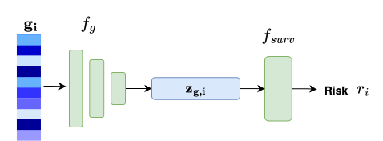
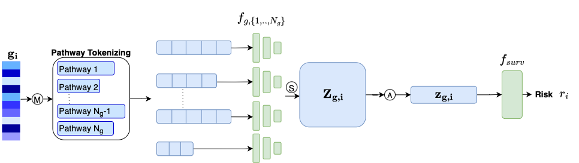
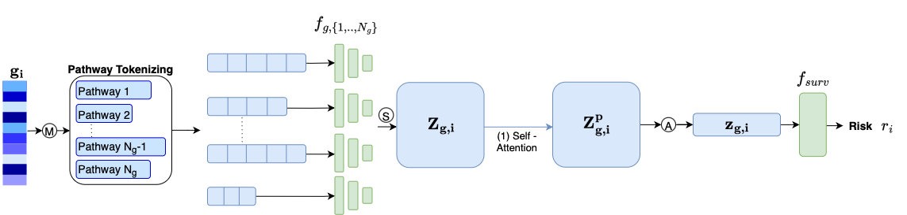

# Code structure

- The `data` folder contains all data, data preprocessing steps and the dataset class used during training and testing the models. See the README in this folder for more information. 
- The `model` folder contains the implementation of the different models.
- The `survival` folder contains all files for survival prediction training and testing, including the implementation of the CoxPH loss. With `get_results.ipynb` you can obtain the performance in c-index and c-index IPCW over all folds (mean±std).
- The `utils` folder contain all helper functions.
- With `plot_km_curves.py` you can perform Kaplan-Meier survival analysis after training and testing the model on all datasets.
- `main.py` is the main file for running the survival prediction code.

# Quick start

## Step 0
Before running anything, activate the conda environment and cd to this directory
```
cd TS_Survival_Prediction/src
conda activate myenv
```

## Step 1: Data preprocessing
First step is to preprocess the data. Currently, this repository supports 4 different TCGA cohorts: BRCA, BLCA, LUAD, and KIRC. 
To preprocess the BRCA data, run the following code:

```
cd data
curl -o files/tcga_brca/HiSeqV2_PANCAN_BRCA.gz https://tcga-xena-hub.s3.us-east-1.amazonaws.com/download/TCGA.BRCA.sampleMap%2FHiSeqV2_PANCAN.gz
gunzip files/tcga_brca/HiSeqV2_PANCAN_BRCA.gz
python preprocess_TCGA.py --data brca --name rna_data
cd ..
```

To preprocess the other data cohorts, change the data source and `--data` argument. Moreover, to remove all genes that are never in te Hallmark Gene Sets, add `--remove`. For more information on downloading and preprocessing the other tcga cohorts, see the README in the data folder.

## Step 2: Train and test the model
Below is a high level explanation of all different (types of) models and how to run them. Please adjust the `--task` (options=[dss_survival_blca, dss_survival_brca, dss_survival_luad, dss_survival_kirc]), `--data_source `and `--exp_code` accordingly. 

### Gene-level models
These models expect the whole gene expression vector as input. You can choose to use all genes, or only the genes in the HallMark gene sets (obtained by adding the `--remove` argument in __Step 1__), by changing `--omics_type` to rna_data_rm. $f_g$ can be an MLP or an SNN (Self Normalizing Neural Network)[^1]. 



To run the gene level model with an MLP (with ReLU and dropout), run the following:
```
# Train
python main.py --model mlp --mode train --task dss_survival_brca --data_source data/files/tcga_brca/ --exp_code MLP --omics_type rna_data

# Test
python main.py --model mlp --mode test --task dss_survival_brca --data_source data/files/tcga_brca/ --exp_code MLP --omics_type rna_data

```

To run the gene level model with an SNN, run the following:
```
# Train
python main.py --model snn --mode train --task dss_survival_brca --data_source data/files/tcga_brca/ --exp_code SNN --omics_type rna_data

# Test
python main.py --model snn --mode test --task dss_survival_brca --data_source data/files/tcga_brca/ --exp_code SNN --omics_type rna_data
```

### Pathway-level models
These models expect the pathway tokenized representations. $f_g$ can be MLP's or SNN's. Moreover, to change the aggregation strategy ((A) in the figure), change the `--aggregation_type` argument (Options=[concat, mean, sum]). 




To run the pathway level model with an MLP (with ReLU and dropout), run the following:
```
# Train
python main.py --model pathway_mlp --mode train --task dss_survival_brca --data_source data/files/tcga_brca/ --exp_code PW_MLP_CONCAT --aggregation_type concat --omics_type rna_data

# Test
python main.py --model pathway_mlp --mode test --task dss_survival_brca --data_source data/files/tcga_brca/ --exp_code PW_MLP_CONCAT --aggregation_type concat --omics_type rna_data
```


To run the pathway level model with an SNN, run the following:
```
# Train
python main.py --model pathway_snn --mode train --task dss_survival_brca --data_source data/files/tcga_brca/ --exp_code PW_SNN_CONCAT --aggregation_type concat --omics_type rna_data

# Test
python main.py --model pathway_snn --mode test --task dss_survival_brca --data_source data/files/tcga_brca/ --exp_code PW_SNN_CONCAT --aggregation_type concat --omics_type rna_data
```


### DIMAF - TS
This model is technically also a pathway level model. Basically, it takes only the Transcriptomics route in the DIMAF architecture[^2]. It starts with the Pathway-level SNN, followed by a self-attention layer, an aggregation layer and a survival prediction final layer.



To run DIMAF - TS, run the following.
```
# Train
python main.py --model gene_dimaf --mode train --task dss_survival_brca --data_source data/files/tcga_brca/ --exp_code DIMAF_ST --aggregation_type mean --omics_type rna_data

# Test
python main.py --model gene_dimaf --mode test --task dss_survival_brca --data_source data/files/tcga_brca/ --exp_code DIMAF_ST --aggregation_type mean --omics_type rna_data
```


To run DIMAF2 - TS, run the following. DIMAF2 is a version of DIMAF, using an ABMIL-based[^3] aggregation technique. 
```
# Train
python main.py --model gene_dimaf --mode train --task dss_survival_brca --data_source data/files/tcga_brca/ --exp_code DIMAF2_ST --aggregation_type wm --omics_type rna_data

# Test
python main.py --model gene_dimaf --mode test --task dss_survival_brca --data_source data/files/tcga_brca/ --exp_code DIMAF2_ST --aggregation_type wm --omics_type rna_data
```


## Step 3: Run Kaplan-Meier analysis.
To run Kaplan-Meier analysis, run the following code, changing the `--exp_code` (from training) and `--model_name` (name of resulting file) accordingly.

```
python plot_KM_curves.py --exp_code PW_SNN_MEAN --model_name Pathway_SNN_Mean
```

# References

[^1]: Klambauer, Günter, et al. "Self-normalizing neural networks." Advances in neural information processing systems 30 (2017). \
[^2]: Eijpe, Aniek, et al. "Disentangled and Interpretable Multimodal Attention Fusion for cancer survival prediction." arXiv preprint arXiv:2503.16069 (2025).  \
[^3]: Ilse, Maximilian, Jakub Tomczak, and Max Welling. "Attention-based deep multiple instance learning." International conference on machine learning. PMLR, 2018.